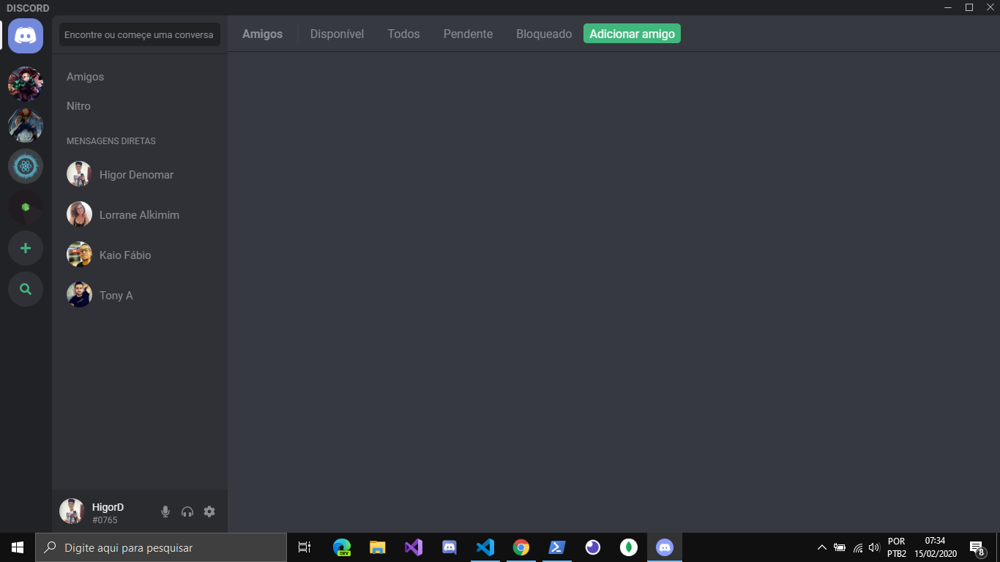

<h3 align="center">

Discord Clone


</h3>

<div align="center">
  Projeto realizado durante a Semana OmniStack #10
</div>
<br/>&nbsp;


<p align="center">
  <a href="#telescope-tecnologias">Tecnologias</a>&nbsp;&nbsp;&nbsp;|&nbsp;&nbsp;&nbsp;
  <a href="#books-projeto">Projeto</a>&nbsp;&nbsp;&nbsp;|&nbsp;&nbsp;&nbsp;
  <a href="#-instalando-o-projeto">Instalação</a>&nbsp;&nbsp;&nbsp;|&nbsp;&nbsp;&nbsp;
  <a href="#-como-contribuir">Como contribuir</a>
</p>

<br/>

<div align="center">
  
</div>

## :telescope: Tecnologias

Para o desenvolvimento deste projeto, foram utilizadas as seguintes tecnologias:

- [React](https://reactjs.org)
- [Electron](https://www.electronjs.org/)

## :books: Projeto

Este é um projeto de estudo das tecnologias citadas acima, onde é recriado a interface do [Discord](https://discordapp.com/) (desktop).

---
## 💻 Instalando o projeto
```
npm install
```
<br/>

Depois execute o projeto com os seguintes comandos:

```
yarn start 

yarn electron
```

## 🤝🏼 Como contribuir

- Faça um fork desse repositório;
- Crie uma branch com a sua adição: `git checkout -b minha-feature`;
- Faça commit das suas alterações: `git commit -m 'feat: Minha alteração'`;
- Faça push para a sua branch: `git push origin minha-feature`.